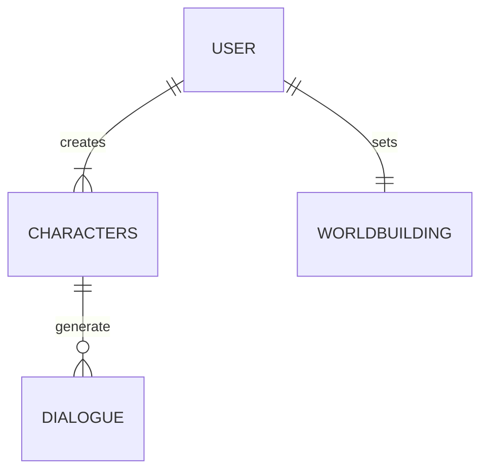

# playground

Repositorio para el proyecto final de ingenieria.

## Backend

###  Como correr en Linux/MacOS

`make local && make install && make run`

El servidor estara corriendo en: http://127.0.0.1:8000

### Windows Install Instructions
  Create a virtual enviroment for Python with the following command in the repo folder
  
  `python -m venv .venv`

  Activate the enviroment

  `.\venv\Scripts\Activate.ps1`

  Check if the enviroment was created successfuly with

  `Get-Command pip`

  You will see an output like this
  
  `appDirectory\venv\Scripts\pip.exe`

  Update your pip version before install the requirements

  `python -m pip install --upgrade pip`

  As last step install the dependencies of aplication with:

  `pip install -r requirements.txt`

### Diagrama base de datos (MongoDB)

