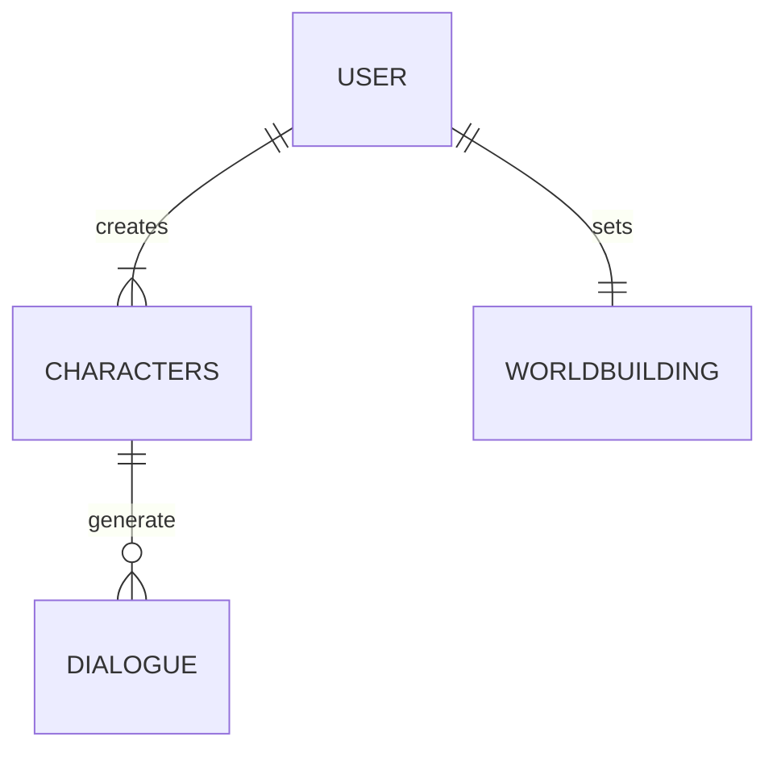

# Playground (Back)

Welcome to the project repository for our final engineering project. This project has been developed using Python 3.11, FASTAPI, and Pip.

## Getting Started

### Prerequisites

Before you begin, make sure you have the following installed on your system:

- Python 3.11
- Python's virtual environment (venv)
- Chocolatey (for Windows)

### Setting Up the Environment

#### For Linux/MacOS

1. Open your terminal.
2. Clone this repository and navigate to the project folder:

   ```bash
   git clone https://github.com/mariabohorquez/playground-backend
   cd playground-backend
   ```
   
3. Create and activate a Python virtual environment:

   ```bash
   python3 -m venv .venv
   source .venv/bin/activate
   make local && make install && make run
   ```
   
5. The server will be running at [http://127.0.0.1:8000](http://127.0.0.1:8000).

#### For Windows

1. Open your command prompt or PowerShell.
2. Clone this repository and navigate to the project folder:

   ```powershell
   git clone https://github.com/mariabohorquez/playground-backend
   cd playground-backend
   ```
   
3. Install Chocolatey package manager following the [choco docs](https://chocolatey.org/install#individual).
   
4. Install the `make` package using Chocolatey:

   ```powershell
   choco install make
   ```

5. Create a virtual environment for Python in the project folder:

   ```powershell
   python3 -m venv .venv
   source .venv/bin/activate
   make local && make install && make run
   ```

## Running the Project

Now that you have set up the environment, you can start the project:

1. Make sure your virtual environment is activated.

2. Run the project with the following command:

   ```bash
   make run
   ```

4. The server will be accessible at [http://127.0.0.1:8000](http://127.0.0.1:8000).

## Database Diagram (MongoDB)


